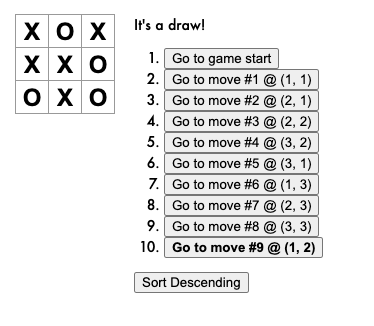

# tic-tac-toe-react

A react tutorial from reactjs.org

## Spec
* Lets you play tic-tac-toe
* Indicates when a player has won the game
* Stores a game’s history as a game progresses
* Allows players to review a game’s history and see previous versions of a game’s board

## Extension options
* ✅ Display the location for each move in the format (col, row) in the move history list.
* ✅ Bold the currently selected item in the move list.
* ✅ Rewrite Board to use two loops to make the squares instead of hardcoding them.
* ✅ Add a toggle button that lets you sort the moves in either ascending or descending order.
* ✅ When someone wins, highlight the three squares that caused the win.
* ✅ When no one wins, display a message about the result being a draw.

## Examples

Winning move: 
  

History of moves: 
  

Sort moves: 
  

Draw game: 
  

